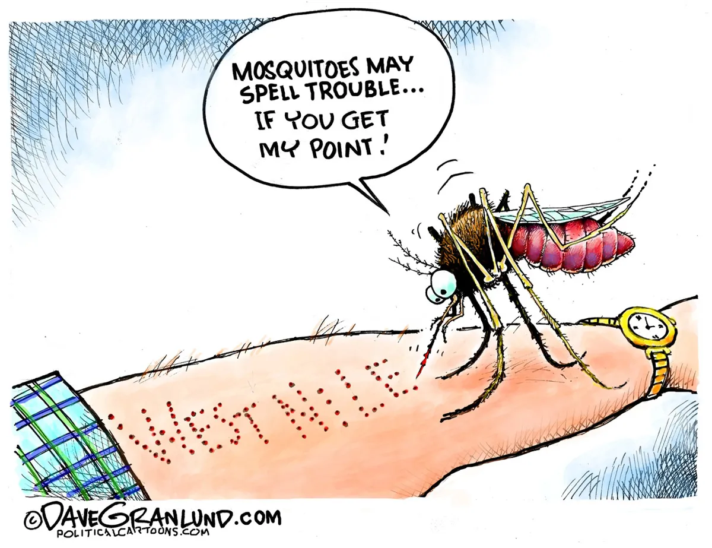

```{css, echo=FALSE}
h1.title {
text-align: center;
}
```

```{r, include=FALSE}
library(tidyverse)
library(plotly)
library(leaflet)
```

<p style="text-align:center;">

```{r, echo=FALSE, out.width="60%", fig.align = 'center'}

```

### **Welcome**

Welcome to our final project website! Our team is united by a shared passion for addressing climate change, understanding infectious diseases, and, of course, our mutual disdain for mosquitoes. This project was inspired by growing evidence linking climate change to the increasing prevalence of mosquito-borne illnesses, particularly West Nile Virus (WNV), in New York City. Explore our website to learn more about how rising temperatures, precipitation patterns, and heat vulnerability contribute to WNV incidence and the effectiveness of NYC’s mosquito control efforts.

</p>

### **Interactive Map**

```{r, echo = FALSE, warning = FALSE}

```

### **Screencast**


